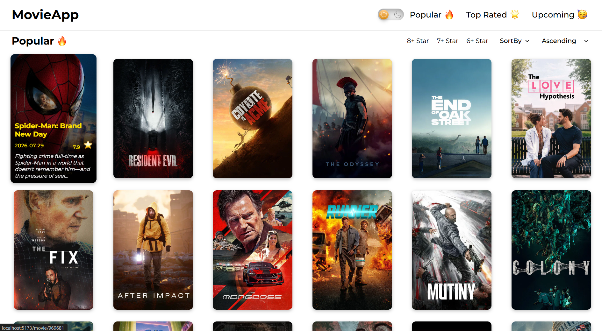
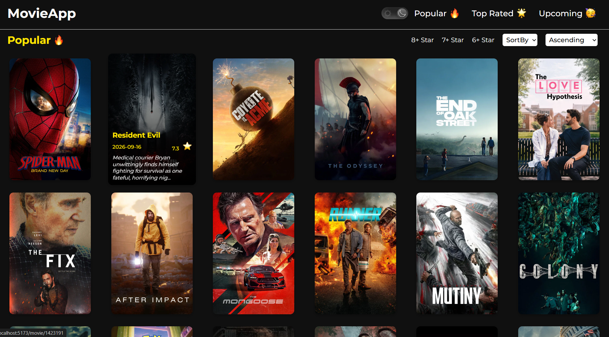
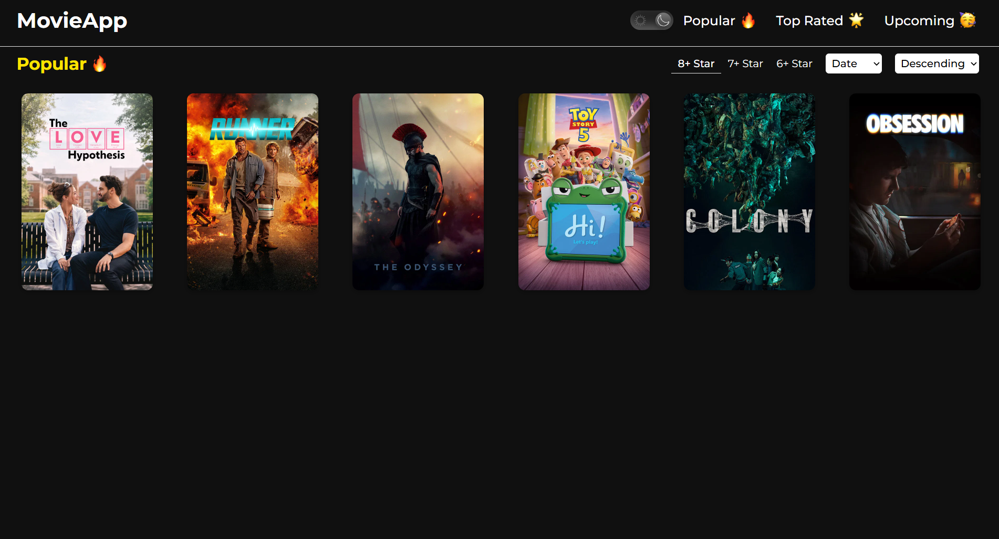
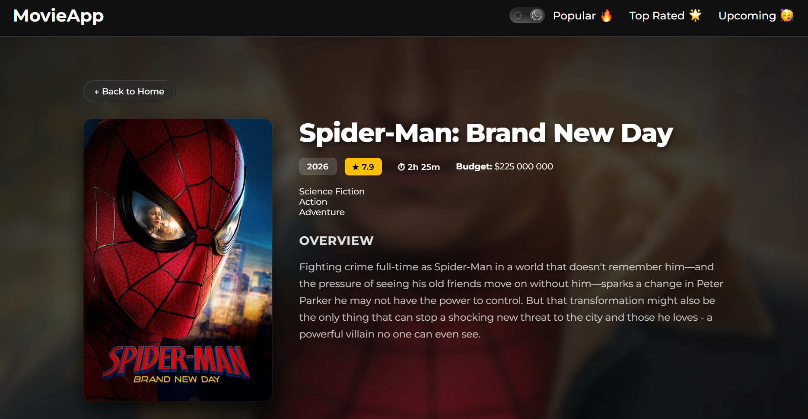
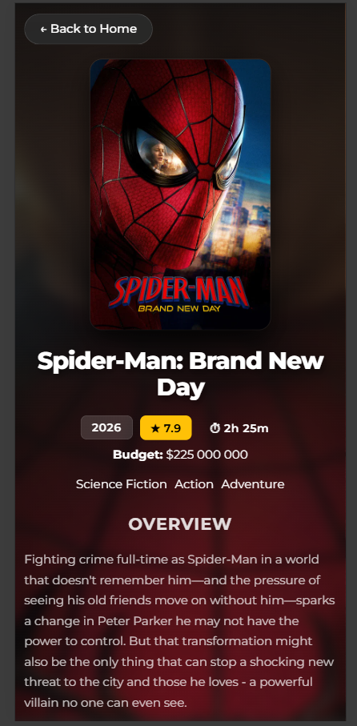

# Movie App

A modern movie discovery application built with React and TypeScript using the TMDB API.

Browse popular, top-rated and upcoming movies, filter and sort them, and open a detail page with cast and trailer.

## Screenshots

## Features

- Popular, Top Rated and Upcoming movie lists
- Filter by minimum rating
- Sort by rating or release date (ascending and descending)
- Movie detail page: backdrop, poster, genres, runtime, budget, overview, top cast and official YouTube trailer
- Loading and error states, stale requests are cancelled when switching tabs
- Fallbacks for movies without a poster or actor photo
- Responsive UI
- Dark mode

## Tech Stack

- React
- TypeScript
- Vite
- React Router
- CSS
- TMDB API

## API

This project uses the [TMDB API](https://www.themoviedb.org/documentation/api) to retrieve:

- Movie lists
- Movie details
- Ratings and release dates
- Genres
- Cast
- Movie images
- Trailers

## Getting Started

1. Clone the repository
2. Install dependencies: `npm install`
3. Create a `.env` file in the project root and add your TMDB API key:
   `VITE_TMDB_API_KEY=your_key_here`
4. Start the dev server: `npm run dev`

## What I Practiced

- Building React applications with TypeScript
- React component architecture and shared types
- React Router and dynamic routes
- Working with URL parameters
- Fetching asynchronous data from a REST API
- Loading and error handling, request cancellation with `AbortController`
- Managing state with `useState` and side effects with `useEffect`
- Optimizing derived data with `useMemo`
- Filtering and sorting data
- Rendering dynamic lists
- Accessible interactive elements
- Responsive UI development
- Dark mode implementation

## License

This project was created for learning and portfolio purposes.

This product uses the TMDB API but is not endorsed or certified by TMDB.
